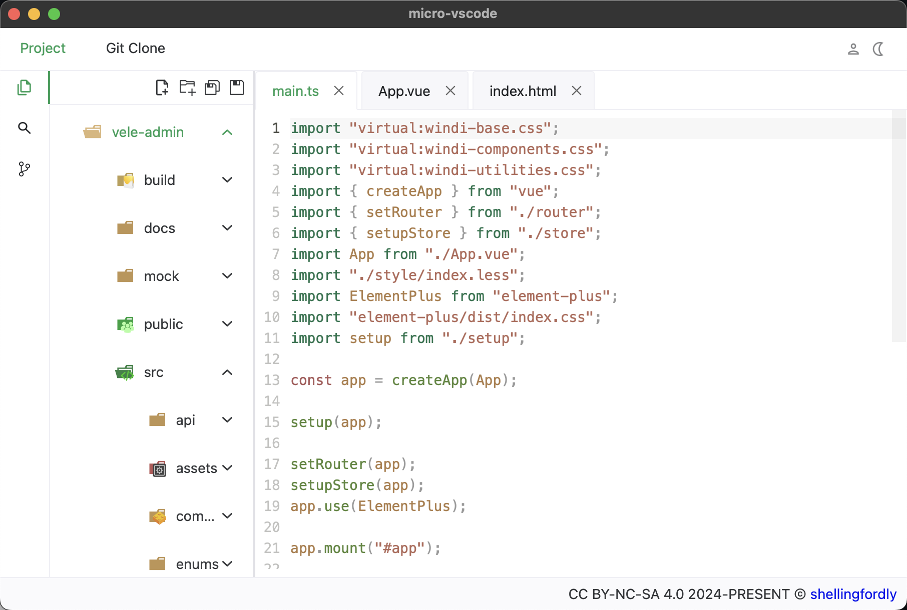
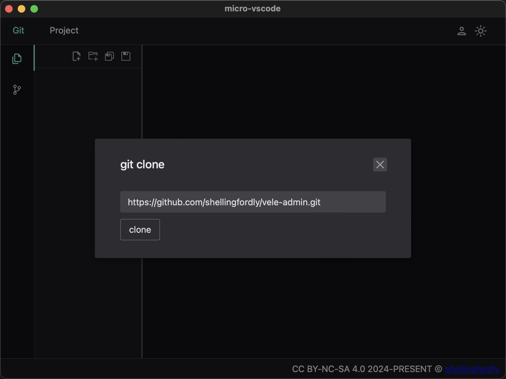
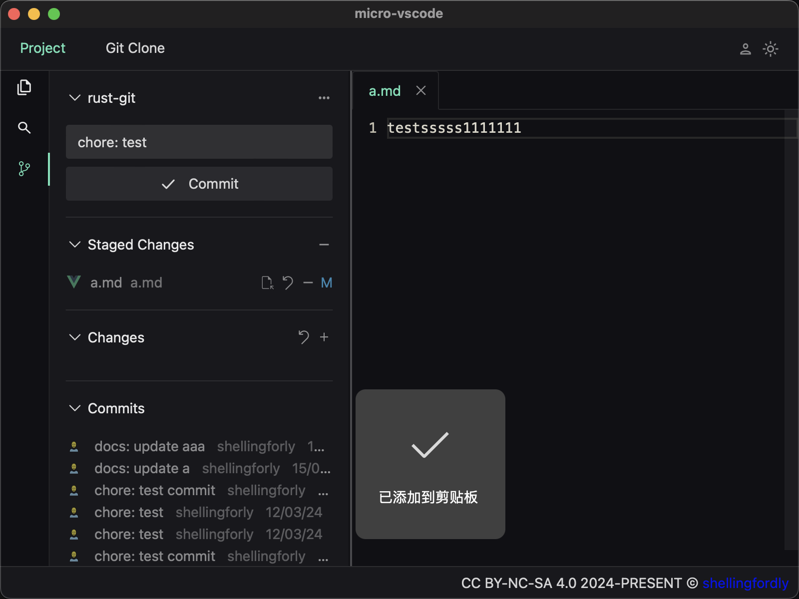
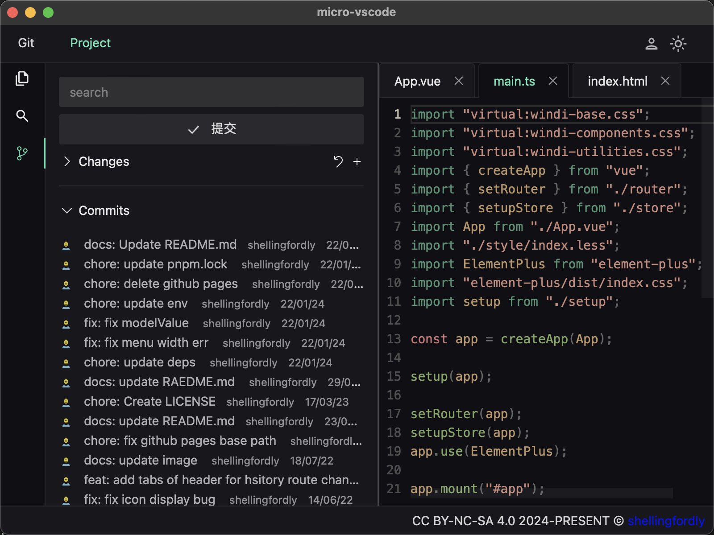
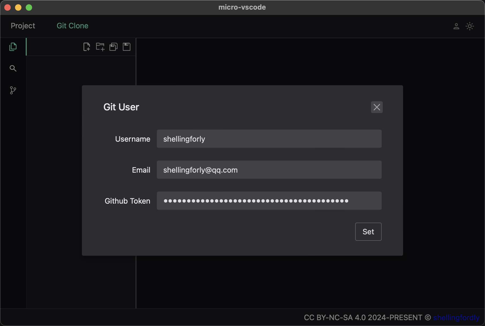
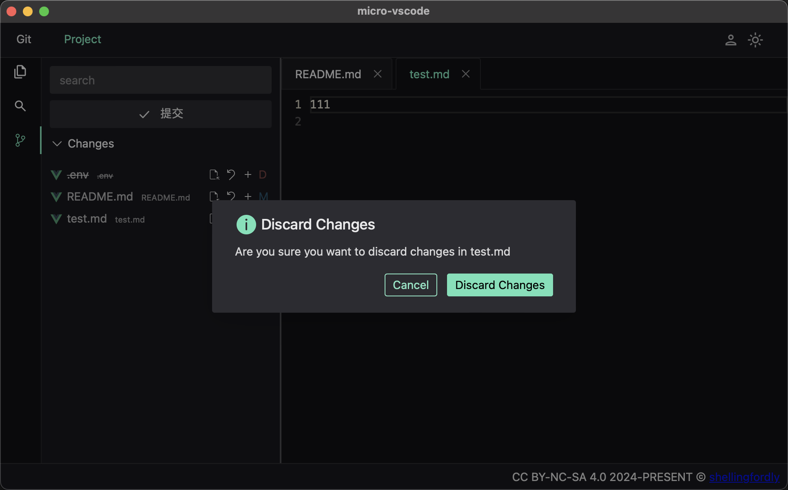
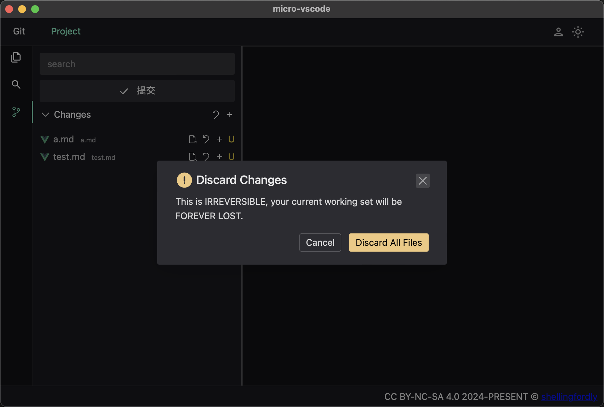
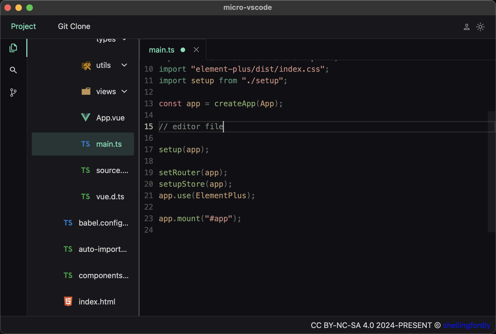

# micro-vscode

The micro-vscode is a lightweight code editing and submission tool build by [tauri](https://github.com/tauri-apps/tauri). It integrated the basic function of git.

This project is only used for learning.

code is licensed under [MIT](https://github.com/shellingfordly/micro-vscode/blob/main/LICENSE),
words and images are licensed under [CC BY-NC-SA 4.0](https://creativecommons.org/licenses/by-nc-sa/4.0/).

## Preview



## Todo List

### Functions

- [ ] read file system
- [ ] new file
- [ ] new folder
- [ ] update git operation same width vscode
- [ ] search
  - [ ] search content
  - [ ] search file by name
- [ ] add i18n support
- [ ] add more themes

### Bug

- [ ] build error

## Features

- Integrated the basic function of git
  - git clone/pull/commit/push
  - set git config username, email and token
  - view changed files, open file, and discard changes
- about project files
  - view project file
  - editor project file
  - write project file

## Development

### In Browser

open http://localhost:1420/

```bash
pnpm run dev
```

### In Tauri Window

```bash
pnpm tauri dev
```

### Build

```bash
pnpm tauri build
```

## Usage

- git clone



- git pull / git push


- git commit



- git log



- set git user



- discard changes




- editor file


