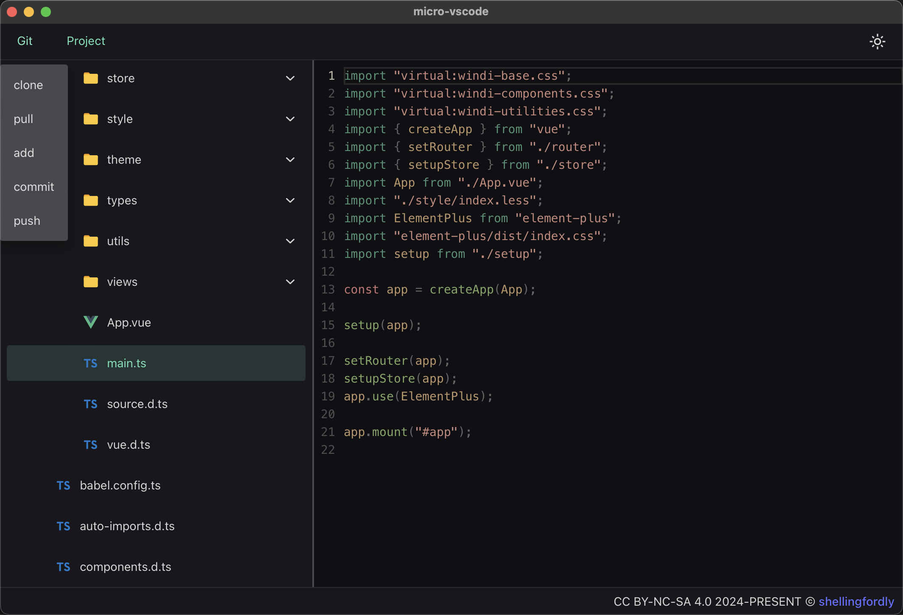
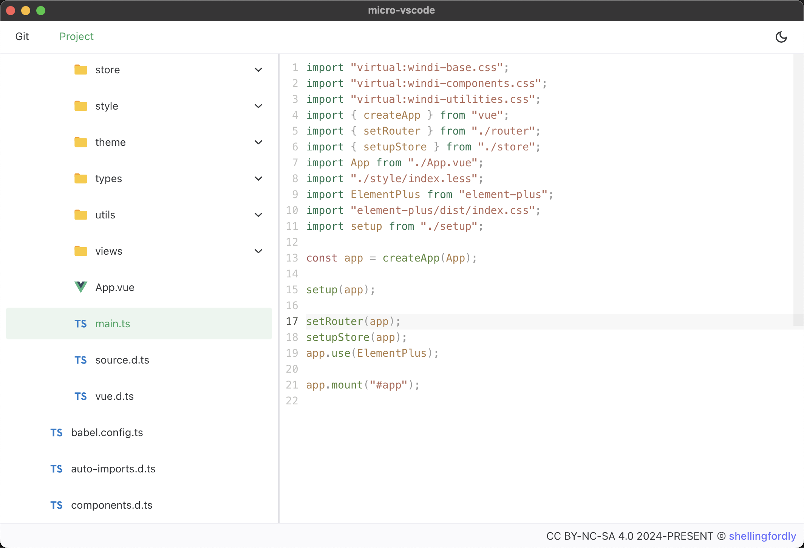

# micro-vscode

A lightweight code editing and submission tool. The micro-vscode integrated the basic function of git.

## Todolist

- [ ] Git
  - [x] clone
  - [ ] pull
  - [ ] add
  - [ ] commit
  - [ ] push
- [ ] Project
  - [x] read
  - [ ] editor
  - [ ] write

## Features

- Integrated the basic function of git
  - git clone
  - git pull
  - git add
  - git commit
  - git push
- about project
  - read project
  - editor project
  - write project

## Development

### In Browser

open http://localhost:1420/

```bash
pnpm run dev
```

### In Tauri Window

```bash
pnpm tauri dev
```

### Build

```bash
pnpm tauri build
```

## Preview




