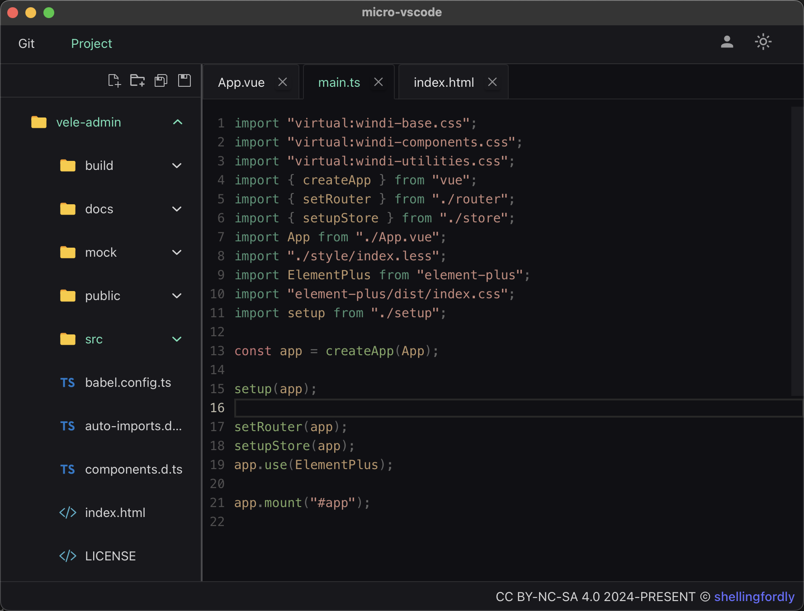

# micro-vscode

A lightweight code editing and submission tool. The micro-vscode integrated the basic function of git.

This project is only used for learning.

code is licensed under [MIT](https://github.com/shellingfordly/micro-vscode/blob/main/LICENSE),
words and images are licensed under [CC BY-NC-SA 4.0](https://creativecommons.org/licenses/by-nc-sa/4.0/).

## Features

- Integrated the basic function of git
  - git clone
  - git pull
  - git commit
  - git push
  - set git config username, email and token
- about project
  - read project
  - editor project
  - write project

## Development

### In Browser

open http://localhost:1420/

```bash
pnpm run dev
```

### In Tauri Window

```bash
pnpm tauri dev
```

### Build

```bash
pnpm tauri build
```

## Preview

- git actions


- dark mode



- light mode


