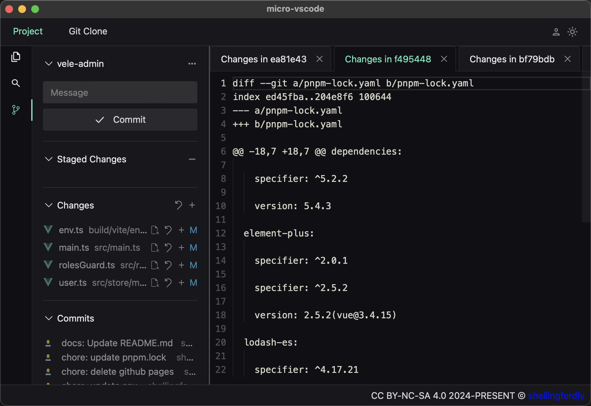

# micro-vscode

The micro-vscode is a lightweight code editing and submission tool build by [tauri](https://github.com/tauri-apps/tauri). It integrated the basic function of git.

This project is only used for learning.

code is licensed under [MIT](https://github.com/shellingfordly/micro-vscode/blob/main/LICENSE),
words and images are licensed under [CC BY-NC-SA 4.0](https://creativecommons.org/licenses/by-nc-sa/4.0/).

## Preview


## TodoList

## Features

- [ ] read file system
- [ ] new file
- [ ] new folder
- [ ] search
  - search content
  - search file by name
- [ ] add i18n support
- [ ] add more themes
- [x] Integrated the basic function of git
  - git config - set user/email/github token
  - git add/commit/pull/push/clone - need to set github token
  - view changed files, open file
  - discard changes and all changes
  - git show commit
- [x] Folder directory structure
  - show directory tree
    - file/folder icon
    - used vscode-icons(Not all transplanted)
    - implement opening/closing of folder
  - show file switching tab
    - whether to edit icon tips
    - close file
- [x] Monaco editor
  - used monaco editor
  - file editor/save/save all functions
  - only supports code highlighting for html/js/json/ts/vue

## Development

### In Browser

open http://localhost:1420/

```bash
pnpm run dev
```

### In Tauri Window

```bash
pnpm tauri dev
```

### Build

```bash
pnpm tauri build
```

## Usage

- git clone


- git pull / git push


- git commit


- git log


- set git user


- discard changes


- git diff



- editor file


## Format instructions

1. 运行脚本命令 `pnpm commit`, 出现提交信息填写框, 填写提交信息, 然后提交

格式化流程：

Hasky增加钩子（hooks）功能，在特定事件（如 commit、push）发生时触发自定义的代码审查、自动化测试、提交描述规范

1. pre-commit钩子：
   在提交前运行，`lint-staged`用于对暂存区的文件是否符合规范，如格式化、lint等。.lintstagedrc配置文件参数 `"prettier --write","eslint --fix", "stylelint --fix"`

2. commit-msg钩子：
   在提交信息前运行，`commitlint`用于检查提交信息是否符合规范

## Github release

1. 运行脚本命令 `pnpm release`,自动检查`UPDATE_LOG.md`是否有版本更新信息。然后增加`package.json`的版本号。同时打 tag 标签（tag 标签是为了触发 github action 工作流）上传到Github

2. github action 工作流
   1. 生成软件自动更新的密钥(windows 密钥生成命令： `pnpm tauri signer generate -w $HOME/.tauri/myapp.key`)
   2. tauri添加更新配置（详细文档说明`https://tauri.app/zh-cn/v1/guides/distribution/updater`）
   3. github Settings > Secrets > Actions > New repository secret > 添加密钥
   4. github action 工作流配置文件 `.github/workflows/release.yml`
